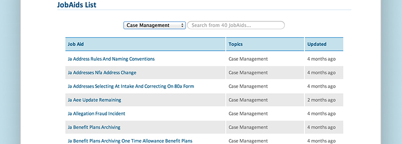

ICM JobAids
===========

> Using Listjs to display the contents of a SP2010 document library

Getting Started
---------------

1. [Install NodeJs](http://nodejs.org/).
2. [Install Grunt and Bower](http://www.nitinh.com/2013/05/getting-started-with-grunt-bower/) `$ npm install -g grunt-cli bower`.
3. [Fork this repo](https://help.github.com/articles/fork-a-repo) `$ git clone https://github.com/TheWebShop/icm-jobaids.git`.
4. [Install development dependencies](http://nodemanual.org/latest/nodejs_dev_guide/npm.html) `$ npm install`.
5. [Install web components](http://bower.io/) `$ bower install`.
6. Start up the development server using [grunt](http://gruntjs.com/) `$ grunt server`.

Although this project was built using [Yeoman](http://yeoman.io/) it is not needed to make future changes. Grunt, however, is. Both to run the development server (which includes [liveReload](https://github.com/gruntjs/grunt-contrib-livereload), and a [SharePoint REST services emulation](https://github.com/TheWebShop/sp2010-rest)) and to compile the project for a production environment.

This project was created using the techniques described in [this gist](https://gist.github.com/Sinetheta/6003037).

Deploying
---------

1. Process the source files into an optimized distributabale form `$ grunt build`.
2. Deploy to The Loop using the custom [copy](https://github.com/gruntjs/grunt-contrib-copy) task `$ grunt copy:sp`.

Once you're satisfied with your changes you can stop the development server and run `$ grunt build` to compile the project into a production-ready form using [all the magic of the Yeoman generator](http://yeoman.io/whyyeoman.html) it's built from. The end product can now be found in the `dist` directory and is ready for deployment.
